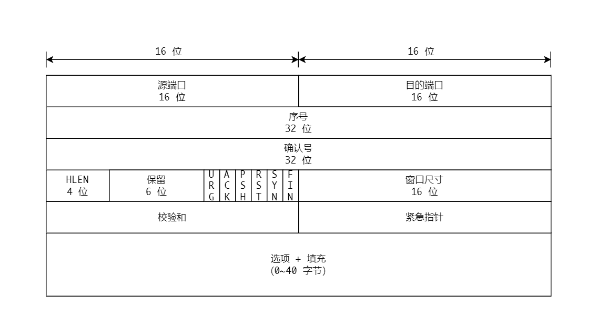
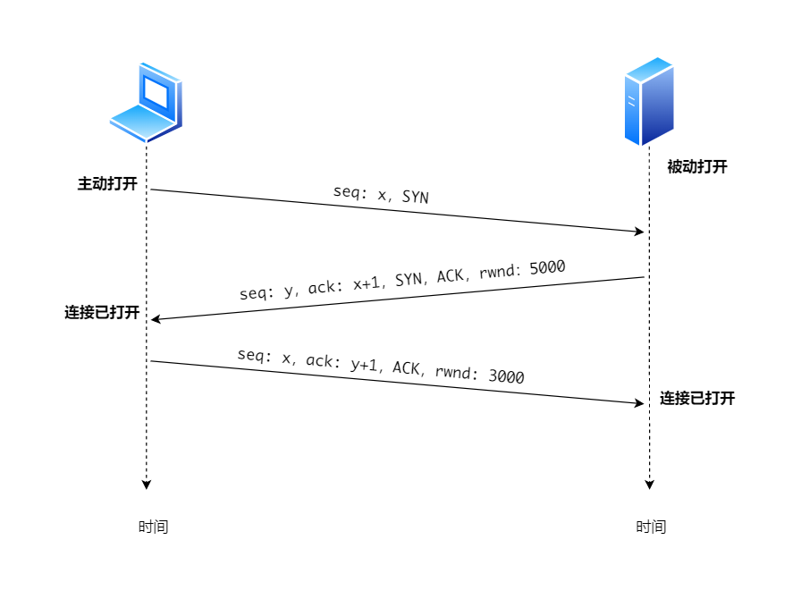
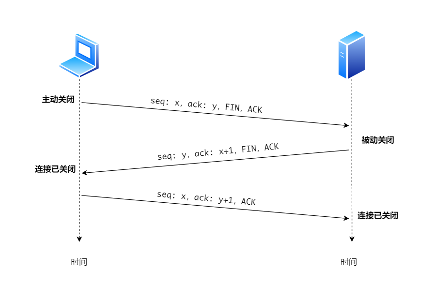
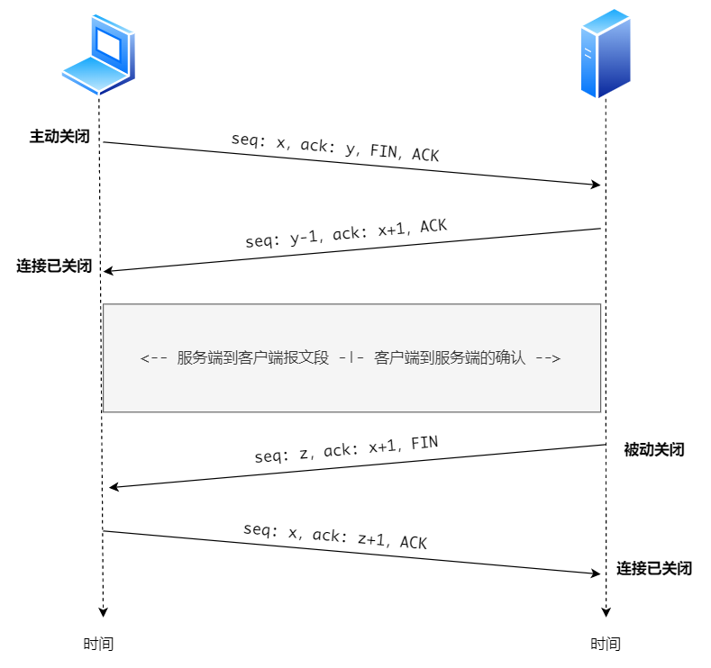
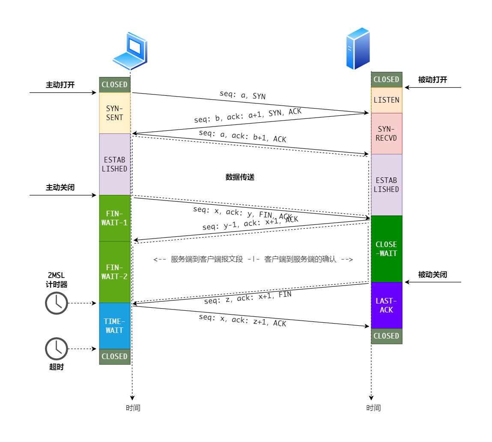

## 介绍

### 进程到进程的通信

与 UDP 一样，TCP 也是使用端口号提供进程到进程的通信。

### 流交付服务

和 UDP 不同，TCP 是一种面向流的协议。在 UDP 中，进程把预先定义好编辑的报文传送给 UDP 以便进行交付，不论是 UDP 还是 IP 都不认为两个 UDP 数据报之间存在关联关系。

TCP 则允许发送进程以字节流的形式传递数据，也允许接收进程把数据作为字节流来接收。

### 全双工通信

TCP 提供全双工服务，即数据可以在同一时间双向流动。TCP 的两个端点的 Scoket 分别有自己的发送缓存和接收缓存，报文段可以在两个方向运动。

### 面向连接的服务

和 UDP 不同，TCP 是面向连接的协议。

TCP 使用 IP 的服务把一个个报文段交付给接收方，但是连接本身是由 TCP 控制的。如果一个报文段丢失或收到损伤，那么这个报文段就被重传，IP 并不知道 TCP 的重传行为；如果一个报文段没有按序到达，那么 TCP 会保留它，直到丢失的报文达到为止，但是 IP 并不知道这个重新排序的过程。

## 编号系统

**序号**
TCP 把在一个连接中要发送的所有数据字节都编上号。两个方向的编号是相互独立的。当 TCP 接收来自进程的数据字节时，就把它们存储在发送缓存中，并为它们进行编号。
!!!note "需要注意的是缓存是和 Socket 对应的，Socket 在 TCP 的两端分别有独立的发送和接收缓存。一个进程可以关联多个 Socket。"

编号不一定要从 0 开始。如果起始编号恰好是 1057，而要发送的数据总共 6000 字节，那么这些字节的编号就是从 1057~7056。

当所有字节都被编上号以后，TCP 就给每一个要发送的报文段指派一个序号。每个报文段的序号就是这个报文段中第一个数据字节被分配的编号。

**确认号**
当一条连接建立后，双方能同时发送和接收数据，通常双方从不同的起始编号开始对字节编号。双方还使用了确认号对各自收到的字节表示确认，不过这个确认号定义的是它期望接收到的下一个自己的编号。另外确认号是累积，意思是如果某一方使用 5643 作为确认号，那就表示它已经收到了从开始一直到编号为 5642 的所有字节。


## 格式

报文段包括了 20~60 字节的首部，其后是应用程序的数据。首部在没有选项时是 20 字节，如果有选项最多可达 60 字节。首部格式如下。

**源端口地址** 16 位的字段，定义发送这个报文段的主机的应用程序的端口号。

**目的端口i地址** 16 位的字段，定义了接收这个报文段的主机的应用程序的端口号。

**序号** 32 位字段，定义了指派给本报文段第一个数据字节的编号。在建立连接时，双方使用各自的随机数产生器产生一个初始序号（Initial Sequence Number，ISN）。通常情况下，两个方向上的 ISN 是不同的。

**确认号** 32 位字段，定义了报文段的接收方期望从对方接收的字节编号。如果报文段的接收方成功接收了对方发来的编号为 x 的字节，那么它就返回 x+1 作为确认号。确认可以和数据捎带在一起发送。

**首部长度** 4 位字段，定义了 TCP 首部一共有多少个 4 字字节。首部长度可以在 20~60 字节之间。因此这个字段的值可以在 5 到 15 之间。

**保留** 6 位字段，保留为今后使用。

**控制** 共 6 位。在同一时间可设置一位或多位标志。

- URG 紧急指针有效的。
- ACK 确认是有效的。
- PSH 请求推送。
- RST 连接复位。
- SYN 同步序号。
- FIN 终止连接。

**窗口大小** 16 位字段，这个字段定义的是发送 TCP 的窗口大小，以字节为单位。窗口大小是由接收方决定的，发送方服从接收方的指示。只有当一个报文段中包含了确认时，定义窗口大小才有意义。

**校验和** 16 位字段。TCP 校验和字段是强制的，和 UDP 一样校验和的计算要包含伪首部和数据部分。

**紧急指针** 16 位字段，只有当紧急标志位时，这个字段才有效，此时报文段中包含了紧急数据。紧急指针定义了一个数值，把这个数值加到序号上就得出报文段数据部分中最后一个紧急字节的编号。

**选项** TCP 首部中有可以多大 40 字节的选项信息。


## 连接

在 TCP 中，面向连接的传输需要经历三个阶段：连接建立、数据传输和连接终止。

### 建立连接

**三向握手**  


**客户端主动打开，C->S 发送报文，seq: x，SYN。**

客户端发送第一个报文段（SYN 报文段），在这个报文段中 SYN 标志置为 1。

SYN 报文段不携带任何数据，但是它要消耗一个序号，这个序号称为初始序号 ISN。

这个报文段不包括确认号，也没有定义窗口大小。只有当一个报文段中包含了确认时，定义窗口大小才有意义。

**服务端被动打开，S->C发送报文，seq: y，ack: x+1，SYN，ACK，rwnd: 5000。**

服务端发送第二个报文段，即 SYN+ACK 报文段，报文段中的这两个标志置 1。SYN + ACK 报文段不携带任何数据，但是它要消耗一个序号。

这个报文段有两个目的，首先。它是另一个方向上通信的 SYN 报文段。服务器使用这个报文段来同步它的初始序号，以便服务器向客户端发送字节。其次，服务器还通过 ACK 标志来确认已收到来自客户端的 SYN 报文段，同时给出期望从客户端客户端收到的下一个序号。

因为这个报文段包含了确认，所以它还需要定义接收窗口大小，即 rwnd，由客户端使用。

**客户端确认，C->S发送报文，seq: x，ack: y+1，ACK，rwnd: 3000。**

客户端发送第三个报文段。这仅仅是一个 ACK 报文段，它使用 ACK 标志和确认号来确认收到了第二个报文段。

需要注意的是这个报文段的序号 SYN 报文段使用的序号一样，即这个 ACK 报文段不消耗任何序号。

客户端在这个报文段中定义服务端发送窗口的大小。

!!!note 关于客户端确认的序号
	最后一次握手的序号也可能是 `x+1`，在使用后面的 `EchoServer` 示例进行抓包时，客户端第三次握手发送的序号就是 `x+1`，但是客户端并没有消耗掉这个序号。在握手结束后，客户端发送的第一个报文段的序号仍是 `x+1`。

**SYN 洪泛攻击**  
当一个或多个恶意攻击的攻击者向某台服务器发送大量的 SYN 报文段，并通过伪造报文段中的源 IP 地址来假装每一个报文段来自不同的客户端时，这个问题就发生了。服务器认为这些客户端发来了主动打开请求，于是就分配必要的资源，并设置一些计时器。然后服务器向这些假冒的客户端发送 SYN+ACK 报文段，而这些报文段都丢失了。

如果在很短的时间内，SYN 报文段的数量很大，服务器最终会因为资源耗尽而不能接受来自合法客户端的连接请求。这种 SYN 洪泛攻击属于拒绝服务（DOS）攻击，即攻击者用大量的服务请求垄断了一个系统，使这个系统因超载而拒绝为合法的请求提供服务。

### 数据传送

在建立连接之后，双向的数据传送就可以开始。客户端和服务器可以在两个方向上传送数据，并且在同一个报文段中也可以携带确认。

### 连接中止

参与数据交换的双方中的任何一方都可以关闭连接，一般来说这是由客户端启动的。目前，大多数 TCP 实现允许连接终止时有两种选择：三向握手和具有办关闭属性的四向握手。

**三向握手**  

**客户端主动关闭，C->S 发送报文，seq: x，FIN+ACK。**

客户端在收到进程的关闭命令后，就发送一个报文段，这是一个将 FIN 标志置 1 的报文段。
zhixiao
FIN 报文段可以包含客户端发送的最后一块数据。或者仅仅只是一个控制报文段，不包含数据的话仅消耗一个序号。

**服务端被动关闭，S->C 发送报文，seq: y，ack: x+1，FIN+ACK。**

服务端在收到客户端的 FIN 报文段后，发送了第二个报文段 FIN+ACK 报文段，以证实它收到了来自客户端的 FIN 报文段，同时也宣布另一个方向正在关闭连接。

这个报文段也可以携带服务端的最后一块数据。如果它不携带数据，则只消耗一个序号。

**客户端确认，C->S 发送报文，seq: x，ack: y+1，ACK。**

客户端发送最后一个 ACK 报文段，以证实从 TCP 服务端收到了 FIN 报文段。

这个报文段不携带数据，并且也不消耗序号。

**半关闭**  
在 TCP 中，连接的一方可以停止发送数据，但是仍然可以接收数据，这就称为半关闭，half-close。

常见的情况是，客户端在在发送完所有的数据之后，可以把客户端到服务器方向的连接关闭。但是，从服务端到客户端连接可以是继续打开的，以便服务端处理完客户端的数据之后将处理结果发送给客户端。



**客户端主动关闭，C->S 发送报文，seq: x，ack: y，FIN+ACK。**

从客户端到服务端的数据传送结束了，客户端就发送一个 FIN 报文段，此连接被半关闭了。

**服务端确认，S->C 发送报文，seq: y-1，ack: x+1，ACK。**

服务端发送 ACK 报文段表示接受半关闭，但是这个时候服务端仍是可以发送数据的。

注意这个单纯的 ACK 报文段是不消耗序号的。

<-- 服务端到客户端报文段 -|- 客户端到服务端的确认 -->

**服务端主动关闭，S->C 发送报文段，seq: z，ack: x+1，FIN+ACK。**

服务端发送完数据之后，关闭服务端到客户端的连接。

**客户端确认，S->C 发送报文段，seq: x，ack: z+ 1，ACK。**

连接关闭，需要注意 ACK 报文段并未消耗序号。

## 状态列表


| 状态          | 说明                            |
| ----------- | ----------------------------- |
| `CLOSED`      | 没有连接。                         |
| `LISTEN`      | 收到了被动打开，等待 SYN。               |
| `SYN-SENT`    | 已发送了 SYN，等待 ACK。              |
| `SYN-RCVD`    | 已发送了 SYN+ACK，等待 ACK。          |
| `ESTABLISHED` | 连接建立，数据传送在进行。                 |
| `FIN-WAIT1`   | 第一个 FIN 已发送，等待 ACK。           |
| `FIN-WAIT2`   | 对第一个 FIN 的 ACK 已收到，等待第二个 FIN。 |
| `CLOSE-WAIT`  | 收到第一个 FIN，已发送 ACK，等待应用程序关闭。   |
| `TIME-WAIT`   | 收到第二个 FIN，已发送 ACK，等待 2MSL 超时。 |
| `LAST-ACK`    | 已发送第二个 FIN，等待 ACK。            |
| `CLOSING`     | 双方都以决定同时关闭。                   |

下图展示了 TCP 建立连接和半关闭终止的时间线图。

**客户端状态**

客户进程向 TCP 发出命令，请求连接某个特定的套接字地址，这就称为主打开。于是 TCP 发出一个 SYN 报文段，进入到 SYN-SENT 状态。

在收到 SYN+ACK 报文段后，TCP 发送 ACK 报文段，并进入 ESTABLISHED 状态。此后数据开始传送和确认。

当客户没有更多的数据要传送时，就发出称为主动关闭的命令。于是 TCP 发送 FIN 报文段，并进入到 FIN-WAIT-1 状态。

## tcpdump


## QA

### Java 实现 Echo 协议代码
```java
package com.haizhi.hivetest;  
  
import java.io.*;  
import java.net.ServerSocket;  
import java.net.Socket;  
import java.nio.charset.StandardCharsets;  
import java.util.Scanner;  
  
public class EchoServer {  
  
    private static final int PORT = 2333;  
  
    public static void main(String[] args) {  
  
        try (ServerSocket serverSocket = new ServerSocket(PORT)) {  
  
            while (true) {  
                Socket accept = serverSocket.accept();  
                new Thread(() -> {  
                    try (InputStream inputStream = accept.getInputStream();  
                         OutputStream outputStream = accept.getOutputStream();  
                         Scanner in = new Scanner(inputStream, "UTF-8");  
                         PrintWriter out = new PrintWriter(new OutputStreamWriter(outputStream, StandardCharsets.UTF_8), true)) {  
                          
                        out.println("Hello! Enter BYE to exit.");  
  
                        boolean done = false;  
                        while (!done && in.hasNextLine()) {  
                            String line = in.nextLine();  
                            out.println("Echo: " + line);  
                            if (line.trim().equalsIgnoreCase("bye")) {  
                                done = true;  
                            }  
                        }  
                    } catch (IOException e) {  
                        e.printStackTrace();  
                    }  
                }).start();  
            }  
        } catch (Exception e) {  
            e.printStackTrace();  
        }  
    }  
}
```

使用 telnet 程序测试。先进性三次握手，telnet 会每敲一个字符就发送一个字符 TCP 包，
```
telnet localhost 2333
Hello! Enter BYE to exit.
a
Echo: a
hello echo server!
Echo: hello echo server!
bye
Echo: bye
```

