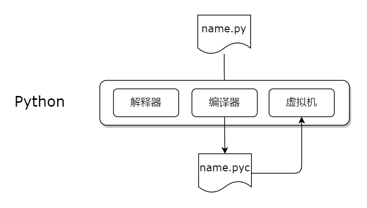

#Python

Python 程序中的语句称为源代码，将程序文件称为源代码文件。根据约定，所有 Python 源代码文件都使用扩展名 `.py` 。


Python 由三个部分组成：运行语句的解释器、将 `.py` 文件转换为 `.pyc` 文件的编译器以及运行 `.pyc` 文件的虚拟机。

## 从键盘读取字符串

源代码如下，`#` 开头的表示注释行；`input` 是内置的标准函数读取输入；然后将用户的输出赋值给 `name` 变量；输出调用了字符串的 `capitalize` 函数，该函数将字符串的首字母大写。

> 使用 dir("") 可以查看字符串包含哪些函数。

```python
# name.py
name = input("What's your first name? ")
print('hello ' + name.capitalize() + '!')
```

使用 `python name.py` 命令运行程序。

## 从键盘读取数字

```python
# age.py
age = int(input('How old are you today? '))
print('In 10 years you will be ' + str((age + 10)) + ' year old.')
```

需要注意的是需要将 age + 10 转换成字符串才能打印，否则 Python 将报错。
## 打印字符串

`print` 是内置的将字符串打印到标准输出的函数。
```python
# print_test.py

print('hello', "world!")

print("你好")
print("世界！")

print("hello world!", end='')
print("你好世界！")
```

输出如下：
```text
G:\suomea-projects\python-core>python print_test.py
hello world!
你好
世界！
hello world!你好世界！

G:\suomea-projects\python-core>
```

默认情况下 `print` 打印完指定的内容之后会添加一个换行符。

## 逻辑运算

Python 使用 True 和 False 表示布尔值。逻辑运算的结果为布尔值。

### 运算符

主要的逻辑运算符有：`not`、`or`、`and`、`==`、`!=`
```python
>>> True == False
False
>>> True and False
False
>>> True or False
True
>>> not True
False
>>> True != False
True
```

### 优先级

如果逻辑运算表达式比较长，可以使用圆括号提升其内部表达式的优先级，优先级从高到底。
- 圆括号内部的表达式
- `==`
- `!=`
- `not` `and`
- `or`

>需要注意的是布尔表达式的求值过程 Python 采用了短路求值技巧。如果表达式的结果已经确定，还未计算到的表达式不会被执行，这样能够提高某些表达式的计算速度。

## IF/ELSE

### if/else
先来看一段简单的密码验证代码，使用了 if/else 关键字。
```python
# password.py
pwd = input("What is your password? ")

if pwd == 'apple' :
    print('Loggin on ...')
else :
    print('Incorrect password!')

print("All done.", end='')
```

首先 if 作为判断语句的开头，其后紧跟布尔表达式，称为条件。

if 条件后面是一个冒号，从 if 关键字开始到冒号为止是一条 if 语句。

if 关键字、条件、冒号必须位于同一行。

else 代码块是可选的。

与 Java 不同的是，Python 使用缩进来表示代码块，在同一个代码块中，所有语句的缩进量必须相同。
### if/elif

if/elif
```python
# age.py
age = int(input("How old are you? "));

if age <= 2 :
    print(" free")
elif 2 < age < 13 :
    print(' child fare')
else :
    print('adult fare')

print('All done!')
```
### 条件表达式

下面两种方式是等价的。

```python
# food.py

food = input("What's your favorite food? ")

if food == 'lamb' :
    reply = 'yuck'
else :
    reply = 'yum';
    
print(reply)
```

```python
# food.py
food = input("What's your favorite food? ")

reply = 'yuck' if food == 'lamb' else 'yum'

print(reply)
```

## 循环
### rage 函数

range 是 Python 内置的函数，返回一个整数序列。使用 `print(range__doc__)` 查看文档。
```
range(stop) -> range object
range(start, stop[, step]) -> range object

Return an object that produces a sequence of integers from start (inclusive)
to stop (exclusive) by step.  range(i, j) produces i, i+1, i+2, ..., j-1.
start defaults to 0, and stop is omitted!  range(4) produces 0, 1, 2, 3.
These are exactly the valid indices for a list of 4 elements.
When step is given, it specifies the increment (or decrement).
```

### for 循环

示例代码。
```python
# for_test.py

# 0, 1, 2, 3, 4, 5, 6, 7, 8, 9
for i in range(10) :
    print(i, end=', ')
print()    

# 0, 1, 2, 3, 4, 5, 6, 7, 8, 9
for i in range(0, 10) :
    print(i, end=', ')
print()    

# 10, 8, 6, 4, 2,  
for i in range(10, 0, -2) :
    print(i, end=', ')
```

### while 循环

示例代码。
```python
# while_test.py
# 0, 1, 2, 3, 4, 5, 6, 7, 8, 9,
i = 0
while i < 10 :
    print(i, end=', ')
    i = i + 1
```

### 计算阶乘

输入数字例如：10
输出：1 x 2 x 3 x 4 x 5 x 6 x 7 x 8 x 9 x 10 的结果

for
```python
# for_fact.py
n = int(input('Enter an integer >= 0: '))
fact = 1;
for i in range(1, n + 1) :
    fact = fact * i
    
print(str(n) +  ' factorial is ' + str(fact))
```

while
```python
# while_fact.py

n = int(input('Enter an integer > 0: '))
fact = 1
i = 1
while i <= n :
    fact = fact * i
    i = i + 1

print(str(n) + ' factorial is ' + str(fact))
```

### 跳出循环

`break` 关键字跳出当前循环；`continue` 关键字立即跳转到循环条件，即进入下一次循环迭代。 
```python
# donesum_break.py
total = 0
while True :
    s = input('Enter a number (or done): ')
    if s == 'done':
        break;
    num = int(s)
    total = total + num
    
print('The sum is ' + str(total))
```